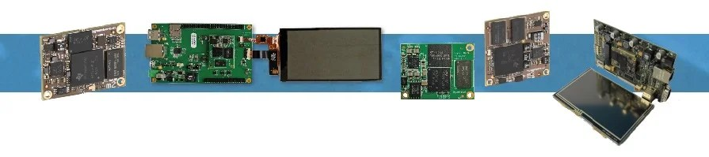

*****************
About the company
*****************

.. image:: ../images/bytes.png
   :scale: 20%
   :align: right
   :target: https://www.bytesatwork.io

bytes at work is a modern Swiss Technology company specialized in industrial computing. Our focus lies on the development of hardware and embedded software, as well as customizing Linux systems. The entire development life cycle takes place in-house with transparent project management and customer involvement. This significantly reduces both development time and development costs.

We have years of experience in developing coordinated hardware and software solutions – from the prototype to the final product. We make your system usable end-to-end for your needs.

 
==============
Our philosophy
==============

Hardware and software for industrial computers have to fulfill an immense range of demanding challenges. They are used in completely different areas of industries and they have to be able to adapt unique and specific tasks. Our employees pay particular attention to each and every customer. That is why our products and services meet and even exceed our customers expectations.

We from bytes at work are aware that the current persistent industrial development also has its darker side. This is our motivation to be exemplary in terms of use of resources. No wonder that unconditional reliability, long service life and low power consumption are main features of all our products.

==========
Trademarks
==========
Product names, logos, brands, and other trademarks featured, or referred to are the property of their respective trademark holders. 
These include, but are not limited to uboot, Linux and ARM.

==========
Disclaimer
==========
Bytes at work AG does not guarantee that the information in this Wiki is up-to-date, correct, complete or of good quality. Nor does bytes at work AG assume guarantee for further usage of the information. Liability claims against bytes at work AG, referring to material or non-material related damages caused, due to usage or non-usage of the information given in the manual, or due to usage of erroneous or incomplete information, are exempted, as long as there is no proven intentional or negligent fault of bytes at work AG. The software provided is optimized for development convenience and is not suitable for use in production. Bytes at work AG explicitly reserves the rights to change or add to the contents of this manual or parts of it without special notification.

.. This is the footer, don't edit after this

