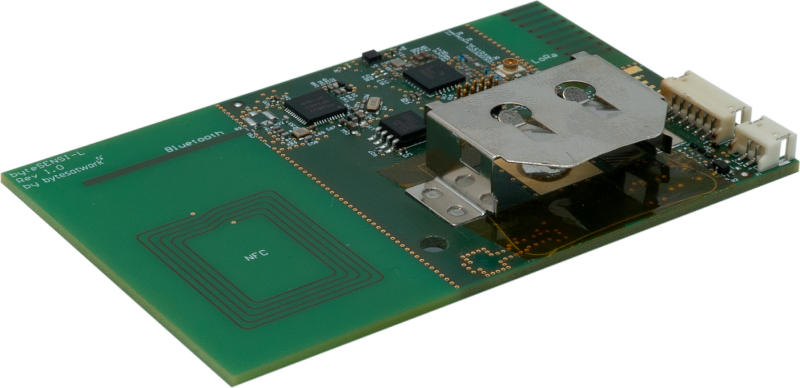

############
byteSENSI-L
############

*********
Overview
*********
The byteSENSI-L is a fun LoRa device based on nRF52 MCU that integrates many sensors.

*********
Hardware
*********

Supported Features
===================

 =========== ============ ==================
  Interface   Controller   Driver/Component
 =========== ============ ==================
 CLOCK       on-chip      clock_control
 FLASH       on-chip	  flash
 GPIO        on-chip	  gpio
 I2C(M)      on-chip	  i2c
 MPU         on-chip	  arch/arm
 NVIC        on-chip	  arch/arm
 RADIO       on-chip	  Bluetooth
 RADIO       Semtech      LoRa
 RTC         on-chip	  system clock
 RTT  	     Segger	  console
 WDT         on-chip	  watchdog
 =========== ============ ==================

Connections and IOs
===================

External Connectors
-------------------

External Supply @ X1
^^^^^^^^^^^^^^^^^^^^

 ======= ============ ==================
  PIN #  Signal Name  Function
 ======= ============ ==================
 1       VBAT	      Power input instead of CR2477 battery
 2       GND          Ground
 ======= ============ ==================

Programming Connector @SL1
^^^^^^^^^^^^^^^^^^^^^^^^^^

 ======= ============
  PIN #  Signal Name
 ======= ============
 1       VBAT
 2       SWDIO
 3	 GND
 4	 SWDCLK
 5	 GND
 6	 NC (SWO)
 7	 NC (Key)
 8	 NC
 9	 GND
 10	 nReset
 ======= ============

I2C Sensor @X3
^^^^^^^^^^^^^^^
 ======= ============ ==================
  PIN #  Signal Name  Function
 ======= ============ ==================
 1       VBAT         Power out
 2       SCL          I2C clock at P0.15
 3	 SDA	      I2C data at P0.16
 4	 INT	      Interrupt at P0.13
 5	 I2C_ADDR     tied to VBAT
 6       GND          Ground
 ======= ============ ==================

One Wire Sensor @X2
^^^^^^^^^^^^^^^^^^^^
 ======= ============ ==================
  PIN #  Signal Name  Function
 ======= ============ ==================
 1       VDD          4V8
 2       IO           One Wire
 3	 GND	      Ground
 ======= ============ ==================

External BLE Antenna @ J1
^^^^^^^^^^^^^^^^^^^^^^^^^^

External LoRa Antenna @ J2
^^^^^^^^^^^^^^^^^^^^^^^^^^

External GPS Antenna @ J3
^^^^^^^^^^^^^^^^^^^^^^^^^^

Programming and Debugging
==========================

Flashing
--------

The byteSENSI-L board can be flashed with the SEGGER JLink programmer. You can build the following samples as demo application:

1. Build the Hello World sample:

::

     $ west build -b bytesensi_l samples/hello_world
     $ west flash

2. Build the LPS22HB: Temperature and Pressure Monitor sample:

:: 

   $ west build -b bytesensi_l samples/sensor/lps22hb
   $ west flash

3. Build the TI_TMP116 Sample sample:

:: 

   $ west build -b bytesensi_l samples/sensor/tmp116
   $ west flash

4. Build the APDS9960 RGB, Ambient Light, Gesture Sensor sample:

::

   $ west build -b bytesensi_l samples/sensor/apds9960
   $ west flash

5. Build the CCS811 Indoor Air Quality Sensor sample:

::

   $ west build -b bytesensi_l samples/sensor/ccs811
   $ west flash

6. Build the LoRa samples:

Using two byteSENSI-L, you can run the LoRa send and receive demo:

::

   $ west build -b bytesensi_l samples/drivers/lora/receive
   $ west flash

::

   $ west build -b bytesensi_l samples/drivers/lora/send
   $ west flash

7. Build the soc-flash-nrf sample:

::

   $ west build -b bytesensi_l samples/drivers/soc_flash_nrf
   $ west flash

8. Build the Bluetooth samples:

Most of the bluetooth samples should work out of the box, for example, building the Bluetooth: Peripheral HIDs sample:

::

   $ west build -b bytesensi_l samples/bluetooth/peripheral_hids
   $ west flash

Debugging
---------

Debugging your application can be done with west debug

Serial console
--------------

The byteSENSI-L board only uses Seggers RTT console for providing serial console. There is no physical serial port available.

.. This is the footer, don't edit after this
.. image:: ../images/wiki_footer.jpg
   :align: center
   :target: https://www.bytesatwork.io>
